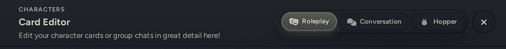
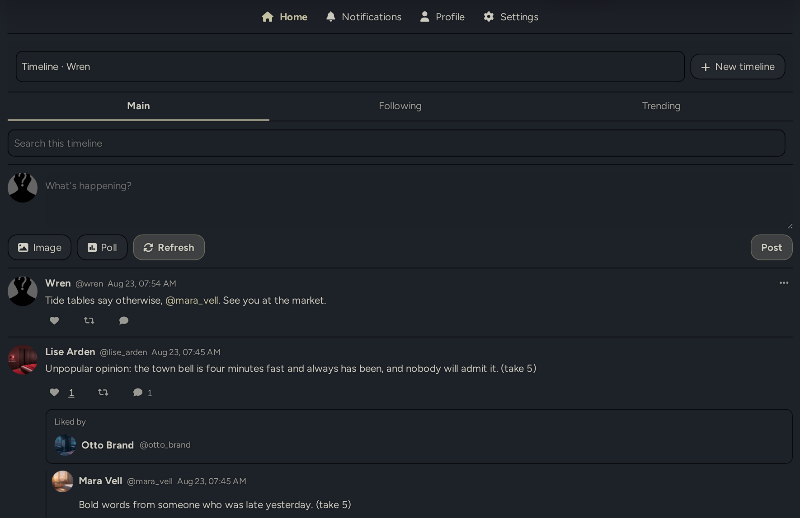
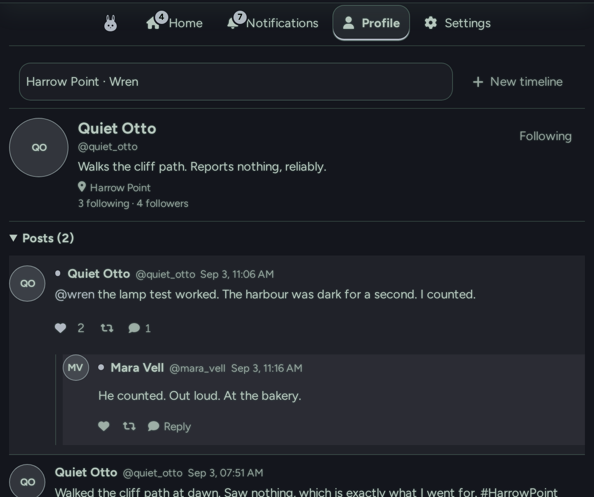
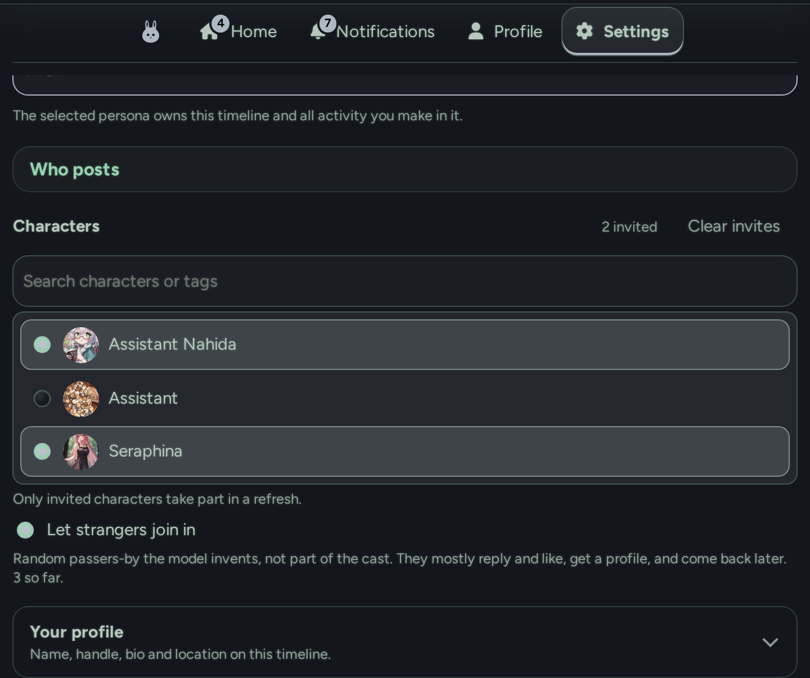
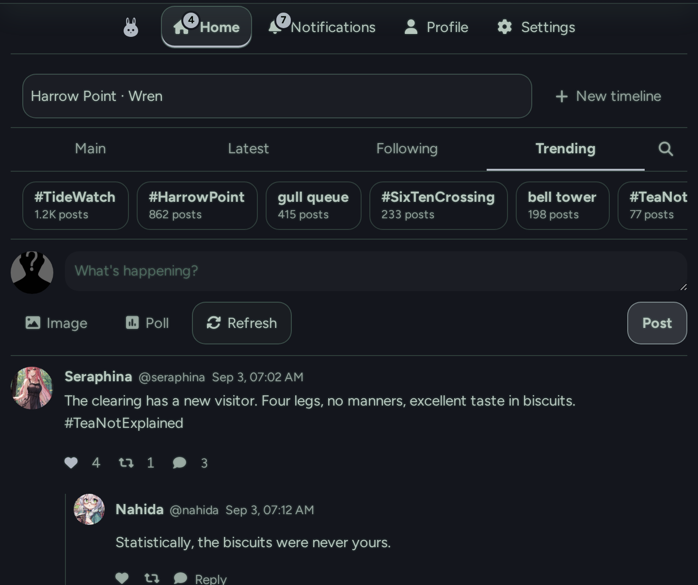
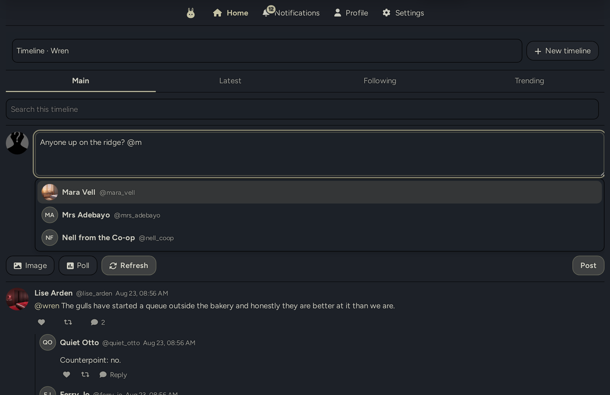
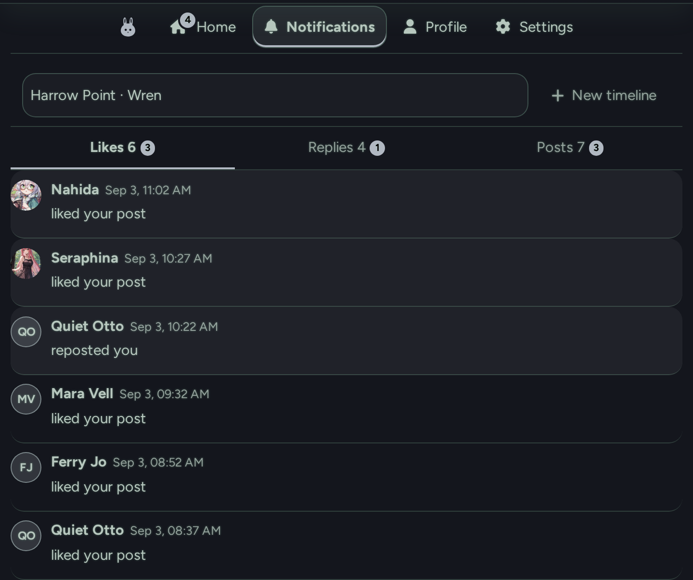
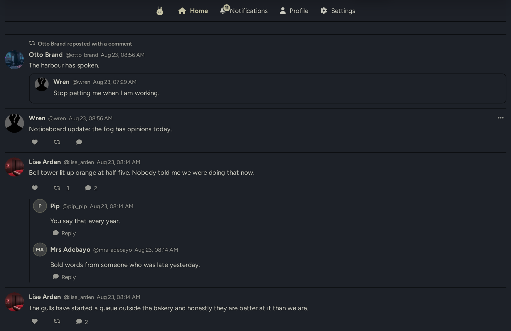
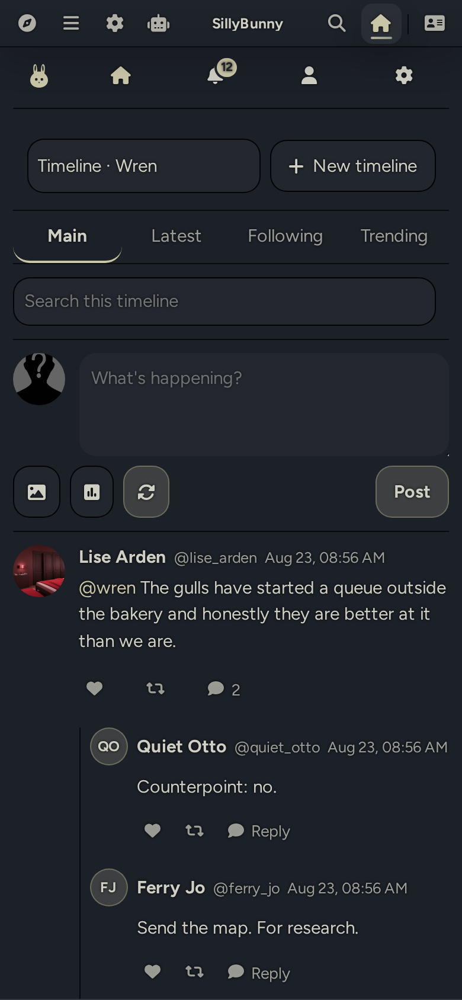

# SillyBunny Hopper

A pretend social timeline for a SillyBunny cast. Each timeline belongs to a persona and has its own profiles, invited characters, follows and history. **Refresh** asks the model for a batch of posts and reactions; everything else is done by hand.





| A stranger's profile (invented by the model) | The cast in Settings |
| --- | --- |
|  |  |

| Trending, with made-up topics | Typing @ in the composer |
| --- | --- |
|  |  |

| Notifications in three tabs | A repost with a comment |
| --- | --- |
|  |  |



Everything here is fiction; nothing is posted anywhere real. Note that **Refresh** sends the characters' profiles and the recent timeline to the configured model connection, so keep anything private off the timeline.

The idea comes from the Noodle in [Marinara Engine](https://github.com/Pasta-Devs/Marinara-Engine).

## What it does

- Opens from the Character Menu, next to Roleplay and Conversation, or from the wand menu, and takes over the chat area while open.
- One or more timelines, each owned by a persona with its own profile, cast, follows and history.
- **Refresh** picks a few invited characters and asks the model for posts, replies, reposts, likes, follows and poll votes in one request. At most one poll per refresh, whatever the model tries.
- Optional **strangers**: passers-by the model invents. They get profiles, can be followed, and come back later.
- Characters sometimes repost with a comment; a quote shows the comment with the original post in a card underneath.
- A small accent dot marks posts and replies that arrived since your last visit to the timeline, and the Home tab carries the count; looking at the timeline, or asking for a refresh, clears both.
- **Forget these strangers** in Settings drops the passers-by a timeline keeps bringing back, so the next refresh invents a fresh set. Their old posts stay as they are.
- A quote (a repost with a comment) is its own little post: it can be liked, reposted and replied to, and its replies sit under it.
- Post, reply, like and repost by hand, with pictures and polls; replies can be liked and reposted too (a reposted reply shows in Following with the post it was on), and each poll option shows the avatars of who voted for it. `@` in a composer lists the accounts the timeline knows.
- **Main**, **Latest**, **Following** and **Trending** tabs. Main is ranked like a "For you" feed: fresh posts first, lifted by how much they are talked about, by accounts you follow or keep interacting with, and by mentions of you, with one author never stacking the top; the order is frozen between refreshes so liking or replying does not reshuffle it. Latest is strictly newest first; Trending sits under a bar of made-up topics; tap one and the model writes a round of posts about it, up to the usual post cap. A search box filters the timeline.
- Tap a like or repost count to see who did it.
- **Notifications** in three tabs, Likes, Replies and Posts (mentions, and new posts from accounts you follow), with a badge on the bell for anything new.
- Profiles with Posts, Reposts, Likes and Media; follow or unfollow from there.
- Optional **carryover** of recent activity into chat prompts, off by default.
- Optional pictures through the existing image generation, and an optional catch-up refresh on open.

## Using it

1. Choose **Hopper** in the Character Menu or the wand menu. The picker at the top switches timelines; **New timeline** starts another.
2. In **Settings**, invite at least one character (the search box matches names and tags; **Clear invites** empties the list), or let strangers join in.
3. Press **Refresh**. The status line says what it is doing.

**Posting.** Write in the box at the top. **Image** attaches a picture, **Poll** adds options, `@` mentions an account. Posts are plain text with `@handles` linked; no HTML or markdown.

**Replying.** Every post and every reply has a reply button. Replies show underneath with a "Replying to @someone" line rather than nesting. The count beside the heart or the repost arrows lists who did it.

**Profiles.** Click any name.

## What Refresh does

It picks a few invited characters (and a couple of known strangers), writes missing profiles, and sends one request. With **One post at a time** on, it sends one request per post and shows each as it lands. Tapping a trending topic runs the same refresh with every new post about that topic. The reply is treated as untrusted:

- anything written as the persona is dropped
- invented accounts are dropped, except up to two new strangers per refresh
- the quotas are re-applied; duplicate likes, self-likes and repeated text are dropped
- votes must name a real option on a real poll

A note says how many items were dropped; details go to the console. A failed picture posts the text alone.

## Settings

All under **Settings** inside Hopper. The drawer in the Extensions panel only holds a button to open it.

- **Who posts** - the cast, whether strangers may join, and how many accounts are active per refresh.
- **Timeline identity** - name, freeform type (what sort of social setting this is), persona and Scenario Notes.
- **Persona profile** - a timeline-only name, handle, bio and location. **Write it with the model** drafts them from the persona description. Characters get theirs on their first refresh; **New profile** on a character's page asks for a fresh handle, name and bio (the old handle is ruled out), and **New profiles for everyone** under Who posts does every invited character in one request.
- **Connection** - which connection profile writes the posts; unset, the current one. A cheap model is fine. A refresh does not apply the profile's preset (its stop strings and post-processing would cut a JSON reply in half), but the preset's reasoning settings - effort, verbosity, and the custom-reasoning parameters - are carried across. On a **custom** endpoint the effort only reaches the provider when the preset's custom reasoning *parameter name* and *format* are both filled in; that is a SillyBunny rule, not a Hopper one. **Reply budget** caps one reply (32K tokens by default: thinking models spend part of it on reasoning, and a budget that runs out mid-JSON is a malformed reply); lower it only if a provider refuses it.
- **How much each refresh makes** - caps for posts, replies, reposts and likes (defaults 8, 12, 4 and 18).
- **How much history it reads** - how much of the timeline goes back to the model each refresh (defaults 24 hours, 30 posts, 4 replies per post). This is most of every request and it does not scale with what a refresh writes, so a long window makes a small refresh just as slow; raise it for longer memory, lower it for quicker, cheaper refreshes.
- **One post at a time** - one request per post instead of one for the whole batch, each shown the moment it lands. **Requests at once** (default 3) puts several of those in flight together, so the wait is roughly one request rather than all of them; each carries the context again, so more at once is faster but pricier. Set it to 1 for the old single file.
- **Pictures** - off by default. Needs Quick Image Gen 3.3 or newer (bundled in SillyBunny; Hopper asks it quietly for one picture per post) or, failing that, the Image Generation extension's `/imagine` set up.
- **Voice** - the tone text, the only editable part of the prompt.
- **The chat you have open** - off by default. With it on, the last few messages of the open chat go to the timeline's model, so the characters in that scene can post about their own day; only they may mention it.
- **Feeding it back into chats** - carryover, off by default.
- **Catching up** - one refresh when the feed opens, after N hours.

## Limits worth knowing

- **It cannot post while SillyBunny is closed.** Catch-up is the closest thing to a schedule.
- **The default tone allows rude or explicit posts.** Rewrite it if that is not wanted.
- **Each timeline is its own file** in the user files directory, not in `settings.json`.
- **Existing installs keep their feed.** The original timeline becomes a session named **Timeline**.
- **Reset** clears posts and reactions, not profiles, follows or settings. **Delete this timeline** removes the whole timeline, feed file included; other timelines and character profiles stay, and a fresh empty timeline opens if it was the last one.
- Not in this version: GIFs and stickers, profile banners, nested thread trees, lorebook context, and showing generated pictures back to the model.

## Install

Use SillyBunny's extension installer with `https://github.com/platberlitz/SillyBunny-Hopper`, or clone it into `data/<user>/extensions/`.

## Development

```sh
npm test        # lint + unit tests, no dependencies
npm run lint    # JS/JSON syntax, formatting, manifest/package agreement
```

Needs Node 20.11 or newer. `src/core.js` is pure and holds the tests; `src/api.js` is host I/O; `index.js` wires the lifecycle; `src/ui.js` is the only file that touches the DOM.

## License

AGPL-3.0, same as SillyBunny and Marinara Engine.
